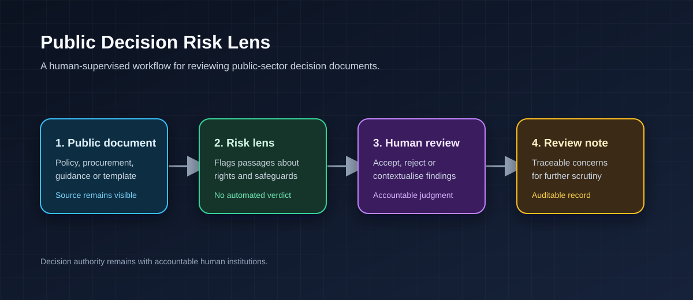

# Public Decision Risk Lens

> **Final project for the [Building AI course](https://buildingai.elementsofai.com/).**

## Summary

**Building AI course project.** Public Decision Risk Lens is a human-supervised concept for reviewing public-sector decision documents before an AI-supported or automated process is introduced. It helps reviewers identify passages that may require closer attention because they affect transparency, accountability, fairness, privacy, or people’s ability to question a decision.

*An official document-signing process, used here as an illustration of how public decisions become formalised. The project concerns document review, not the institution or people depicted.*

### Project status

- **Current stage:** concept and governance design
- **Future stage:** source-linked prototype for public documents
- **Decision authority:** remains human, accountable, and open to challenge

## Background

Public authorities increasingly use digital tools to support policy development, procurement, service delivery, and administrative decision-making. These tools can improve consistency and efficiency, but they can also create risks when their purpose, data use, responsibility, or limits are unclear.

The project addresses an early stage in this process: reviewing documents before a system is procured or deployed. Its purpose is not to decide whether a system is lawful, fair, or legitimate. Instead, it helps public-sector teams locate questions that require professional, legal, democratic, and human consideration.

## How is it used?

A policy analyst, procurement officer, data-protection specialist, or oversight team selects a public policy, procurement specification, impact assessment, guideline, or decision template for review. The proposed tool highlights passages that may concern transparency, accountability, discrimination, privacy, contestability, human oversight, security, or misuse.

Each flag is linked to the relevant passage and risk category. A human reviewer then accepts, rejects, or contextualises the flag and records a review note. The intended output is an auditable discussion aid, not an automated verdict.

## Data sources and AI methods

A future prototype could use public Swedish and EU policy documents, official guidance, procurement documents, and published algorithmic-impact assessments. The quality, completeness, and institutional context of these documents would remain essential limitations.

The initial approach should be conservative: source-linked information retrieval and transparent pattern matching. Later work could assess supervised classification or retrieval-augmented language models, but only where every output retains source references, confidence indicators, review logs, and mandatory human validation.

The project must not score citizens, determine eligibility, infer protected characteristics, or make final decisions about individuals.

## Challenges

Institutional risk cannot be reduced to keywords or a model score. A system may miss important concerns, flag ordinary language without context, or reproduce assumptions present in its source material. Public documents can also omit the operational practices, datasets, and informal routines that shape real outcomes.

The project cannot establish that a policy or system is lawful, fair, or legitimate. Human expertise, legal review, affected groups’ perspectives, and democratic accountability remain necessary throughout the process.

## What next?

The next step would be to develop a transparent risk taxonomy with public-sector practitioners, legal experts, and affected groups. A small source-linked prototype could then be tested on public documents, followed by an expert-labelled evaluation set that measures usefulness, false-positive rates, and reviewer agreement.

Any pilot should remain low-risk and advisory. It should strengthen review and accountability, never replace public authority, individual due process, or the right to challenge a decision.

## Acknowledgments

- The original workflow diagram in `assets/risk-lens-workflow.svg` was created for this project and is covered by this repository’s [CC BY 4.0 licence](LICENSE).
- The illustrative photograph, [*Signing of the General Appropriations Act of 2025 A*](https://commons.wikimedia.org/wiki/File:Signing_of_the_General_Appropriations_Act_of_2025_A.jpg), is by the Philippine Presidential Communications Office and is marked **Public Domain** on Wikimedia Commons. It is used only as a general illustration of official document-signing.
- No external code or datasets are included in this project.
